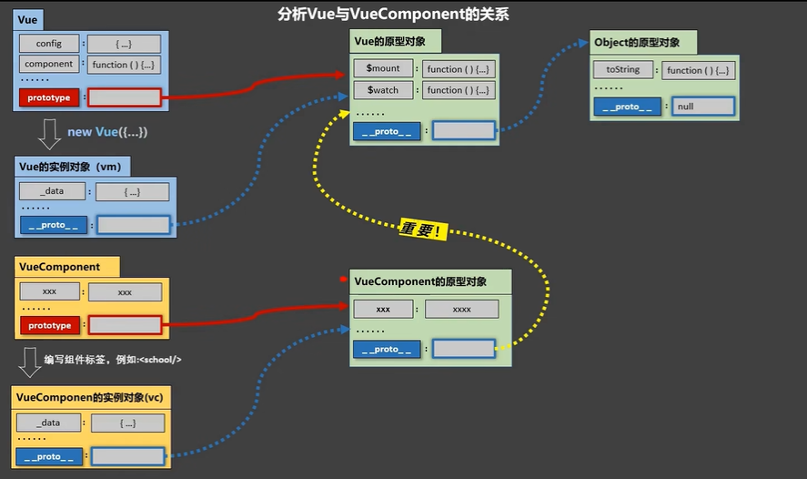

#### 内置指令

v-bind  =>  :        页面数据更改后不会影响 data 中的值     （单向绑定）

v-model			  页面数据更改后 data 中的值也会被修改  （双向绑定）

v-on      =>  @

v-text指令：

​      1.作用：向其所在的节点中渲染文本内容。

​      2.与插值语法的区别：v-text会替换掉节点中的内容，{{xx}}则不会。


v-html指令：

​            1.作用：向指定节点中渲染包含html结构的内容。

​            2.与插值语法的区别：

​                  (1).v-html会替换掉节点中所有的内容，{{xx}}则不会。

​                  (2).v-html可以识别html结构。

​            3.严重注意：v-html有安全性问题！！！！

​                  (1).在网站上动态渲染任意HTML是非常危险的，容易导致XSS攻击。

​                  (2).一定要在可信的内容上使用v-html，永不要用在用户提交的内容上！


v-cloak指令（没有值）：

​            1.本质是一个特殊属性，Vue实例创建完毕并接管容器后，会删掉v-cloak属性。

​            2.使用css配合v-cloak可以解决网速慢时页面展示出{{xxx}}的问题。


v-once指令：

​            1.v-once所在节点在初次动态渲染后，就视为静态内容了。

​            2.以后数据的改变不会引起v-once所在结构的更新，可以用于优化性能。


v-pre指令：

​          1.跳过其所在节点的编译过程。

​          2.可利用它跳过：没有使用指令语法、没有使用插值语法的节点，会加快编译。


#### 自定义指令

一、定义语法：

​                  (1).局部指令：

​                        `new Vue({`                            

​                          	`directives:{指令名:配置对象}`  

```vue
				   `})` 
```


​    					或                                

​						 `new Vue({`

​                             `directives{指令名:回调函数}`

```vue
					 `})`
```

​						注意回调函数、配置对象中的this 指向的是 window

​                  (2).全局指令：

​                          Vue.directive(指令名,配置对象)         或         Vue.directive(指令名,回调函数)


​            二、配置对象中常用的3个回调：

​                  (1).bind：指令与元素成功绑定时调用。

​                  (2).inserted：指令所在元素被插入页面时调用。

​                  (3).update：指令所在模板结构被重新解析时调用。


​            三、备注：

​                  1.指令定义时不加v-，但使用时要加v-；

​                  2.指令名如果是多个单词，要使用kebab-case命名方式，不要用camelCase命名。


#### 事件修饰符

Vue中的事件修饰符：

​      1.prevent：阻止默认事件（常用）；

​      2.stop：阻止事件冒泡（常用）；

​      3.once：事件只触发一次（常用）；

​      4.capture：使用事件的捕获模式；

​      5.self：只有event.target是当前操作的元素时才触发事件；

​      6.passive：事件的默认行为立即执行，无需等待事件回调执行完毕；

#### 条件渲染

v-show ="condition"   如果设置为false 不显示但结构还在

v-if="condition" 		  如果设置为false 不显示且结构也不在  

v-if 与 template 配合使用可以不破坏结构


#### 列表渲染

v-for

1.遍历对象数组`<li v-for="p in persons" :key="p.id">{{p.name}}---{{p.age}}</li>`

2.遍历对象 `<li v-for="(value,attr) of car" :key="attr">{{attr}}---{{value}}</li>`

3.遍历String `<li v-for="(char,index) of str" :key="index">{{index}}---{{char}}</li>`

4.遍历指定次数 `<li v-for="(number,index) of 5" :key="index">{{index}}---{{number}}</li>`

(要保证key的值是唯一的) 


#### 列表排序


#### 监测数据

Vue监视数据的原理：

​        1. vue会监视data中所有层次的数据。


​        2. 如何监测对象中的数据？

​                通过setter实现监视，且要在new Vue时就传入要监测的数据。

​                  (1).对象中后追加的属性，Vue默认不做响应式处理

​                  (2).如需给后添加的属性做响应式，请使用如下API：

​                          Vue.set(target，propertyName/index，value) 或 

​                          vm.$set(target，propertyName/index，value)


​        3. 如何监测数组中的数据？

​                  通过包裹数组更新元素的方法实现，本质就是做了两件事：

​                    (1).调用原生对应的方法对数组进行更新。

​                    (2).重新解析模板，进而更新页面。


​        4.在Vue修改数组中的某个元素一定要用如下方法：

​              1.使用这些API:push()、pop()、shift()、unshift()、splice()、sort()、reverse()

​              2.Vue.set() 或 vm.$set()

​        

​        特别注意：Vue.set() 和 vm.$set() 不能给vm 或 vm的根数据对象 添加属性！！！


####  收集表单数据

​          若：`<input type="text"/>`，则v-model收集的是value值，用户输入的就是value值。

​          若：`<input type="radio"/>`，则v-model收集的是value值，且要给标签配置value值。

​          若：`<input type="checkbox"/>`

​              1.没有配置input的value属性，那么收集的就是checked（勾选 or 未勾选，是布尔值）

​              2.配置input的value属性:

​                  (1)v-model的初始值是非数组，那么收集的就是checked（勾选 or 未勾选，是布尔值）

​                  (2)v-model的初始值是数组，那么收集的的就是value组成的数组

​          备注：v-model的三个修饰符：

​                  lazy：失去焦点再收集数据

​                  number：输入字符串转为有效的数字

​                  trim：输入首尾空格过滤


#### 过滤器

​        定义：对要显示的数据进行特定格式化后再显示（适用于一些简单逻辑的处理）。

​        语法：

​            1.注册过滤器：Vue.filter(name,callback)   全局   或  new Vue({ filters:{} })  局部

​            2.使用过滤器：{{ xxx | 过滤器名}}  或  v-bind:属性 = "xxx | 过滤器名"

​        备注：

​            1.过滤器也可以接收额外参数、多个过滤器也可以串联

​            2.并没有改变原本的数据, 是产生新的对应的数据


#### 生命周期

​	1.又名：生命周期回调函数、生命周期函数、生命周期钩子。

​    2.是什么：Vue在关键时刻帮我们调用的一些特殊名称的函数。

​    3.生命周期函数的名字不可更改，但函数的具体内容是程序员根据需求编写的。

​    4.生命周期函数中的this指向是vm 或 组件实例对象。


#####      挂载 

​     Vue完成模板的解析并把初始的真实DOM元素放入页面后（挂载完毕）调用mounted()


##### 常用的生命周期钩子：

​       1.mounted: 发送ajax请求、启动定时器、绑定自定义事件、订阅消息等【初始化操作】。

​       2.beforeDestroy: 清除定时器、解绑自定义事件、取消订阅消息等【收尾工作】。


 关于销毁Vue实例

​       1.销毁后借助Vue开发者工具看不到任何信息。

​       2.销毁后自定义事件会失效，但原生DOM事件依然有效。

​       3.一般不会在beforeDestroy操作数据，因为即便操作数据，也不会再触发更新流程了。


------


#### 组件

定义：实现应用中局部功能代码和资源的集合


 Vue中使用组件的三大步骤：

​          一、定义组件(创建组件)

​          二、注册组件

​          三、使用组件(写组件标签)


#####       一、如何定义一个组件？

​            使用Vue.extend(options)创建，其中options和new Vue(options)时传入的那个options几乎一样，但也有点区别；

​            区别如下：

​                1.el不要写，为什么？ ——— 最终所有的组件都要经过一个vm的管理，由vm中的el决定服务哪个容器。

​                2.data必须写成函数，为什么？ ———— 避免组件被复用时，数据存在引用关系。

​            备注：使用template可以配置组件结构。


#####       二、如何注册组件？

​              1.局部注册：靠new Vue的时候传入components选项

​              2.全局注册：靠Vue.component('组件名',组件)


#####       三、编写组件标签：

​              `<school></school>`


几个注意点：

​          1.关于组件名:

​                一个单词组成：

​                      第一种写法(首字母小写)：school

​                      第二种写法(首字母大写)：School

​                多个单词组成：

​                      第一种写法(kebab-case命名)：my-school

​                      第二种写法(CamelCase命名)：MySchool (需要Vue脚手架支持)

​                备注：

​                    (1).组件名尽可能回避HTML中已有的元素名称，例如：h2、H2都不行。

​                    (2).可以使用name配置项指定组件在开发者工具中呈现的名字。


​          2.关于组件标签:

​                第一种写法：<school></school>

​                第二种写法：<school/>

​                备注：不用使用脚手架时，<school/>会导致后续组件不能渲染。


​          3.一个简写方式：

​                const school = Vue.extend(options) 可简写为：const school = options


##### 		关于VueComponent：

​            1.school组件本质是一个名为VueComponent的构造函数，且不是程序员定义的，是Vue.extend生成的。


​            2.我们只需要写<school/>或<school></school>，Vue解析时会帮我们创建school组件的实例对象，

​              即Vue帮我们执行的：new VueComponent(options)。


​            3.特别注意：每次调用Vue.extend，返回的都是一个<u>全新的VueComponent</u>！！！！


​            4.关于this指向：

​                (1).组件配置中：

​                      data函数、methods中的函数、watch中的函数、computed中的函数 它们的this均是        					【VueComponent实例对象】。

​                (2).new Vue(options)配置中：

​                      data函数、methods中的函数、watch中的函数、computed中的函数 它们的this均是

​					【Vue实例对象】。


​            5.VueComponent的实例对象，以后简称vc（也可称之为：组件实例对象）。

​              Vue的实例对象，以后简称vm。


```javascript
function Demo(){
	this.a = 1
	this.b = 2
}

const c = new Demo()
Demo.prototype   //显示原型属性
c.__proto__		 //隐式原型属性
                 //这两个属性都指向同一个原型

```



